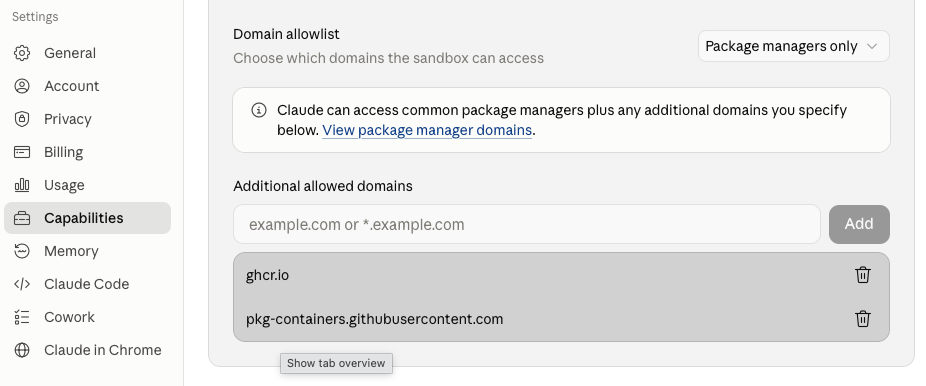

# Installing and Running ACL2 Docker Images

For ACL2 documentation, tutorials, and reference material, see:
- [ACL2 Documentation](https://www.cs.utexas.edu/~moore/acl2/) - Official ACL2 homepage
- [ACL2 Manual](https://acl2.org/doc/) - Searchable online documentation

## Which Image?

Four images are published, all built from the same Dockerfile.  They
differ in which books come pre-certified, which platforms they run on, how
much you download, and how fresh their ACL2 is:

| Image | Certified books | Platforms | Download (approx.) | ACL2 version | Best for |
|-------|-----------------|-----------|--------------------|--------------|----------|
| `ghcr.io/kestrelinstitute/acl2` | none (all books present as source) | amd64, arm64 | 1 GB | master at build time; rebuilt occasionally | the smallest download; certifying your own choice of books |
| `ghcr.io/kestrelinstitute/acl2-kcerts` | `kestrel/top` and everything it depends on, plus the STP and Z3 solvers | amd64, arm64 | 3 GB | master at build time; rebuilt occasionally | Apple Silicon (native arm64); the Kestrel libraries and Axe, ready to include |
| `ghcr.io/kestrelinstitute/acl2-kcerts-nightly` | same as `acl2-kcerts` | amd64 | 3 GB | **last night's master** | the freshest ACL2 with the Kestrel libraries, on amd64 |
| `ghcr.io/kestrelinstitute/acl2-allcerts` | the full `make regression` suite, plus STP and Z3, plus the xdoc agent corpus | amd64 | 6 GB | master at build time; rebuilt occasionally | everything pre-certified; documentation lookup for agents |

Download sizes are compressed; the images take roughly three times that
on disk (tens of GB for allcerts).  Current sizes are shown on each
package's page.  The exact ACL2 commit an image contains is in its
`master-<sha>` tag (see "Image Tags" below).

**Which one?**  On an amd64 machine wanting the Kestrel libraries, take
`acl2-kcerts-nightly` (freshest); on Apple Silicon, take
`acl2-kcerts` (native arm64 — the amd64-only images run under emulation,
slowly); if you want every community book certified, or the documentation
corpus, take `acl2-allcerts`; if you want the smallest download and will
certify books yourself, take `acl2`.

## Quick Start

1. Pull an image with certified books.  `acl2-kcerts` works on both
   platforms; on amd64, `acl2-kcerts-nightly` is the same with a fresher
   ACL2.
```bash
docker pull ghcr.io/kestrelinstitute/acl2-kcerts:latest
```

2. Run it.  With no command given, the container starts ACL2 directly.
   (The `--rm` flag cleans up the container after exit.)
```bash
docker run -it --rm ghcr.io/kestrelinstitute/acl2-kcerts:latest
```

3. Inside ACL2, include any book in the image's certified set — no
   certification step needed:
```lisp
(include-book "std/lists/top" :dir :system)
(include-book "kestrel/axe/top" :dir :system)
```

Type `(quit)` to exit ACL2 (and the container).  To get a shell instead of
ACL2, append `bash` to the `docker run` command; to work on your own files,
see "Mounting Local Files" below.

## The Lean Image

The `acl2` image contains every community book as source but certifies
none of them, so you certify what you need:

1. Pull the image and get a shell in the container:
```bash
docker pull ghcr.io/kestrelinstitute/acl2:latest
docker run -it --rm ghcr.io/kestrelinstitute/acl2:latest bash
```

2. Certify the books you need (use -j for parallel jobs):
```bash
cd books && cert.pl -j4 std/lists/top
```

3. Run ACL2 and include the book you certified:
```bash
acl2
```
```lisp
(include-book "std/lists/top" :dir :system)
```

Type `(quit)` to exit ACL2, and `exit` to leave the container.  Certified
books are lost when a `--rm` container exits; see "Saving an Image with
Certified Books" below to keep them.

---

## The Images With Certified Books

The `acl2-kcerts`, `acl2-kcerts-nightly`, and `acl2-allcerts` images skip
the "certify the books you need" step for their book sets, so
`include-book` works immediately for any already-certified book.  Books
outside an image's certified set are still present as source and can be
certified in the container as usual with `cert.pl`.

Notes:

- **Size**: these images are large (certificates plus compiled books for
  their whole book set; tens of GB on disk for allcerts).  Make sure Docker
  has enough disk before pulling.
- **Platform**: `acl2-kcerts` is multi-platform.  `acl2-allcerts` and
  `acl2-kcerts-nightly` are linux/amd64 only; they run on Apple Silicon via
  emulation, but slowly — on arm64 machines prefer the kcerts or lean
  image.
- **Nightly vs. kcerts**: the two contain the same certified book set;
  choose by freshness and platform (see "Which Image?").  The nightly
  skips nights when ACL2 master has not changed, so its `latest` is always
  the newest master that differed.  It is built entirely on GitHub-hosted
  runners with public logs — see "Automating Builds" in README.md.  Its
  package also holds `ckpt-*` tags (internal build checkpoints; ignore
  them), and its image shows more layers than `acl2-kcerts` because of how
  it is built.
- **Solvers included** (all three images):
  - **STP** (for the Axe toolkit) is installed at `/usr/local/bin/stp`.
    Axe's `defthm-stp`, `prove-with-stp`, etc. work out of the box.  The
    default `ACL2_STP_VARIETY` (2) is correct for the installed STP; you can
    export a different value if you experiment with other STP versions.
  - **Z3 with Python bindings** (for Smtlink) lives in a virtualenv at
    `/root/.venvs/smtlink` (its `bin`, containing `z3` and `python`, is on
    `PATH`).  The Smtlink configuration `/root/smtlink-config` points at that
    Python by absolute path and was in place when the Smtlink books were
    certified.
- **Which books are certified**:
  - kcerts and kcerts-nightly: `kestrel/top` and its dependency tree
    (certified with `cert.pl kestrel/top`).
  - allcerts: everything in `make regression`, which is all books except
    the `SLOW_BOOKS` list in `books/GNUmakefile` (a handful of very slow
    books, e.g. the x86isa and filesystem proof developments).
- **Removed artifacts**: to keep the image (relatively) small, files not
  needed after certification were deleted: `.cert.out` proof logs,
  `.cert.time`, `.pcert0`/`.pcert1`, and `workxxx` files.  Each certified
  book retains its source, its `.cert`, its compiled `.fasl`, its `.port`
  file, and (for two-pass books) its `.acl2x` and `@expansion.lsp` files.
  The retained build-system files are needed to certify new books on top
  of the ones in the image: cert.pl loads the `.port` file of every
  included book, and treats `.acl2x` files as dependencies that it would
  otherwise spend time regenerating.  If you want to see a book's proof
  output, just re-certify it in the container.
- **`CERT_PL_RM_OUTFILES=1`** is set in the image, so books you certify
  yourself also have their `.cert.out` deleted on success (failures keep
  theirs, for debugging).  `unset CERT_PL_RM_OUTFILES` to change that.
- **Agent documentation corpus** (allcerts only): the image contains
  `books/doc/agent-corpus/` — the full xdoc manual converted to one
  plain-text file per topic plus a grep-able `index.tsv`, designed for
  AI agents (and handy for humans): `grep -i 'tail recursion'
  books/doc/agent-corpus/index.tsv` finds topics in milliseconds; see
  `AGENT-README.md` in that directory.  The same corpus is published as
  a small tarball on the
  [xdoc-corpus release](https://github.com/KestrelInstitute/acl2-docker/releases/tag/xdoc-corpus)
  for use outside this image (kcerts sessions, air-gapped environments).
  See `tools/DESIGN.md` for how it is built.
- **Updating ACL2 inside these images** (git pull + `make update`) is possible
  but rarely useful: previously certified books become stale with respect to
  the new executable.  Prefer pulling a newer image build.

### Using the images from a Claude (Cowork) cloud session

Claude's cloud sandboxes can pull and run these images, which turns a fresh
Claude session into a ready-to-go ACL2 development environment in a couple of
minutes (no building, no book certification).

**One-time account setup** (a human must do this; Claude cannot): the
sandbox's network must be allowed to reach the registry.  In the Claude app
under **Settings → Capabilities → Domain allowlist**, keep "Package managers
only" and add two **Additional allowed domains**:

```
ghcr.io
pkg-containers.githubusercontent.com
```

(The first serves the image manifests; the second serves the actual layer
blobs, so pulls fail partway without it.)



**Then paste this to a new Claude session:**

````text
Please set up ACL2 in this sandbox from the prebuilt Docker image, as
follows.

1. The Docker daemon is not running by default, and it must be started
   with this sandbox's egress proxy settings or registry pulls fail
   with 403:

   ```bash
   sudo env HTTP_PROXY="$HTTPS_PROXY" HTTPS_PROXY="$HTTPS_PROXY" NO_PROXY="$NO_PROXY" \
     dockerd --iptables=false --ip6tables=false > /tmp/dockerd.log 2>&1 &
   ```

2. Pull `ghcr.io/kestrelinstitute/acl2-allcerts:latest` (all regression
   books certified), or `ghcr.io/kestrelinstitute/acl2-kcerts:latest`
   (smaller; the kestrel/top books), or
   `ghcr.io/kestrelinstitute/acl2-kcerts-nightly:latest` (the kestrel/top
   books certified on last night's ACL2 master).  These are linux/amd64
   images.
   If a tag is not found, list what exists with an anonymous token:
   `curl -s "https://ghcr.io/token?scope=repository:kestrelinstitute/acl2-allcerts:pull"`
   then GET `https://ghcr.io/v2/kestrelinstitute/acl2-allcerts/tags/list`
   with that bearer token.

3. Do ACL2 work inside the container (mount the working directory):

   ```bash
   docker run -it --rm -v "$PWD":/work -w /work \
     ghcr.io/kestrelinstitute/acl2-allcerts:latest bash
   ```

   Inside: `acl2` starts ACL2, and every book in the image's certified
   set can be included immediately, e.g.
   `(include-book "kestrel/axe/top" :dir :system)`.  The STP solver (for
   Axe) and Z3 (for Smtlink) are installed and configured.

4. To certify a NEW book, use `cert.pl my-book` (from the directory
   containing it).  If the book uses Axe's STP tools (`defthm-stp`,
   `prove-with-stp`, ...), first create `my-book.acl2` next to it
   containing:

   ```
   ; cert-flags: ? t :ttags :all :skip-proofs-okp t
   ```

   (ttags because Axe's solver interface carries trust tags;
   skip-proofs-okp because STP-backed events are recorded that way.)

5. Sanity checks that should all succeed: `stp --version` and
   `z3 --version` in the container; a small `defthm-stp` proof; and
   `find books -name '*.cert' | wc -l` reporting thousands of books.
````

Notes: the sandbox typically has few cores and modest RAM, which is fine
for interactive proof development and certifying small books, but not for
re-certifying large books or running wide parallel regressions — that is
what the pre-certified images are for.  The `docker save`/release-asset
route is an alternative when registry access is unavailable.

### Driving ACL2 through the acl2-mcp server (recommended for agents)

For more than a couple of ACL2 interactions, the
[acl2-mcp](https://github.com/bendyarm/acl2-mcp) server is much more
efficient than piping commands into `acl2`: it keeps a **persistent ACL2
session**, so the world (included books, definitions, theorems) survives
across an agent's tool calls instead of being rebuilt in a fresh ACL2 for
every shell command.  Claude cloud sandboxes cannot register MCP servers in
their tool harness, but the server can be driven directly over stdio using
the dependency-free client shipped in the acl2-mcp repository.

**Paste this to the Claude session after the image setup above:**

````text
Please also set up the acl2-mcp server so ACL2 interactions keep a
persistent session, as follows.

1. Run the image as a persistent container and install the server in it
   (host networking so pip can reach PyPI; the sandbox intercepts TLS
   with its own CA, which the container must be told to trust):

   ```bash
   git clone https://github.com/bendyarm/acl2-mcp
   docker run -d --name acl2dev --network=host \
     -v "$PWD/acl2-mcp":/opt/acl2-mcp -v "$PWD":/work \
     ghcr.io/kestrelinstitute/acl2-allcerts:latest sleep infinity
   for f in /usr/local/share/ca-certificates/*.crt; do
     docker cp "$f" acl2dev:/usr/local/share/ca-certificates/
   done
   docker exec acl2dev bash -c \
     'update-ca-certificates && python3 -m venv /root/.venvs/mcp \
      && /root/.venvs/mcp/bin/pip install --quiet /opt/acl2-mcp'
   ```

2. Verify with the client's self-test (it starts a session, evaluates
   `(+ 1 2)`, and ends the session):

   ```bash
   python3 acl2-mcp/for-agents/mcp_stdio_client.py \
     docker exec -i acl2dev /root/.venvs/mcp/bin/acl2-mcp
   ```

3. Then drive ACL2 from your own Python using that client.  IMPORTANT:
   sessions live inside the server process, so create ONE `MCP` instance
   and keep it alive for the whole interaction (e.g. run a long-lived
   driver script, or structure work as one script per proof task):

   ```python
   import sys; sys.path.insert(0, "acl2-mcp/for-agents")
   from mcp_stdio_client import MCP
   m = MCP(["docker", "exec", "-i", "acl2dev", "/root/.venvs/mcp/bin/acl2-mcp"])
   m.initialize()
   sid = m.start_session()
   print(m.call("evaluate", {"code": '(include-book "kestrel/axe/top" :dir :system)',
                             "session_id": sid}))
   print(m.call("evaluate", {"code": "(defthm ...)", "session_id": sid}))
   ```

   The most useful tools: `evaluate` (anything you would type at the
   ACL2 prompt, including `:pe`, `:pbt`, `:doc`), `undo`,
   `certify_book` (cert.pl-backed), `admit` (try an event without
   committing it), and `end_session`.  Books already certified in the
   image include instantly inside a session.
````

---

## Setup

### Prerequisites

Install Docker for your platform:
- **Linux**: [Docker Engine](https://docs.docker.com/engine/install/)
- **macOS**: [Docker Desktop](https://www.docker.com/products/docker-desktop/) (Intel and Apple Silicon)
- **Windows**: [Docker Desktop](https://www.docker.com/products/docker-desktop/) (follow instructions to install WSL 2 if needed)

### Image Tags

All four packages use the same tagging scheme:

| Tag | Description | Git Status inside image |
|-----|-------------|-------------------------|
| `latest` | Most recent master build | On `master` branch, `git pull origin master` works |
| `master-abc1234` | Built from master at commit abc1234 | On `master` branch, `git pull origin master` works |
| `commit-abc1234` | Built from specific commit abc1234 | Detached HEAD, see "Updating ACL2" section |

Two packages carry extra tags you can ignore: `acl2-kcerts` has
per-architecture tags (`master-abc1234-amd64`, `master-abc1234-arm64`),
the carriers of its multi-platform manifest; `acl2-kcerts-nightly` has
`ckpt-*` tags, internal checkpoints of in-progress builds.  The nightly
has no `commit-*` tags, since it always builds master.

### Verifying Image Authenticity

None of the images carry a signed build attestation.  The `acl2`,
`acl2-kcerts`, and `acl2-allcerts` packages are built on Kestrel's own
machines, where GitHub's artifact attestations are not available; the
nightly package is built entirely on GitHub-hosted runners and every step
of each build is publicly logged in the acl2-docker repository's Actions
history, but it is not attested at present either.  To make sure you run
exactly the image you examined, pin it by digest rather than by tag.  The digest of a tag is shown on the package
page and by:

```bash
docker buildx imagetools inspect ghcr.io/kestrelinstitute/acl2:latest
```

Then pull by digest:

```bash
docker pull ghcr.io/kestrelinstitute/acl2@sha256:<digest>
```

The ACL2 commit an image was built from is recorded in its
`org.opencontainers.image.revision` label; see "Checking Image Version"
below.

---

## Running a Container

### Mounting Local Files

To access your local files from inside the container, use the `-v` flag. In the following examples your files will be available at `/work` inside the container.

**Linux:**
```bash
docker run -it --rm -v /path/to/my-acl2-project:/work ghcr.io/kestrelinstitute/acl2:latest bash
```

**macOS:**
```bash
docker run -it --rm -v ~/my-acl2-project:/work ghcr.io/kestrelinstitute/acl2:latest bash
```

**Windows** (PowerShell):
```powershell
docker run -it --rm -v C:\Users\YourName\acl2-project:/work ghcr.io/kestrelinstitute/acl2:latest bash
```

### Memory Configuration (macOS/Windows)

For large proof efforts, you may need to increase Docker Desktop's memory limit:

1. Open Docker Desktop
2. Go to **Settings** → **Resources** → **Advanced**
3. Increase **Memory** (At least 32 GB recommended for full ACL2 regression with `-j9`)
4. Click **Apply & Restart**

---

## Working with ACL2

### Certifying Books

Every image includes all ACL2 books as source code; the lean `acl2` image
certifies none of them, and the others certify only their book sets.
Anything else you certify yourself.

When you certify a book, all the books it depends on are also certified. Since many books are independent of each other, we recommend using the `-j` option based on how many cores you have free.

```bash
# Certify a specific library, such as the Kestrel ARM model
cd books
cert.pl -j4 kestrel/arm/top
```

There are also `make` targets that certify groups of books:

```bash
# Certify the "basic" books (good for testing)
make -j4 basic

# Run the full certification regression (takes several hours)
make -j4 regression
```

### Saving an Image with Certified Books

By default, `docker run --rm` discards changes when you exit. To save your certified books for reuse:

1. Start the container **without** `--rm`:
   ```bash
   docker run -it ghcr.io/kestrelinstitute/acl2:latest bash
   ```

2. Certify your books, then exit the container.

3. Find your stopped container:
   ```bash
   docker ps -a
   ```

4. Save it as a new image.
   ```bash
   docker commit --change='CMD ["acl2"]' <container-id> my-acl2-certified:v1
   ```
   When you started the container with the `bash` command, it overwrote the default
   startup command of `acl2`.  The `--change` option restores that default.

5. Run your new image.  If you omit the command at the end, it will enter ACL2 automatically:
   ```bash
   docker run -it --rm my-acl2-certified:v1
   ```

---

## Maintenance

### Updating ACL2

#### Master Builds (`master-*` tags)

Images tagged `master-abc1234` are set up with proper Git branch tracking. You can update directly in the docker container.
If you do this, you will probably want to follow the instructions above
on starting the container without `--rm` and committing the result to a new image.

First get the updates:

```bash
cd /root/acl2
git pull origin master
```

After updating, rebuild the ACL2 executable if anything going into it has changed:

```bash
make update LISP=`which sbcl`
```

You may want to certify some books before committing the new docker image.

#### Commit Builds (`commit-*` tags)

Images tagged `commit-abc1234` are in Git "detached HEAD" mode. To update to the latest master, follow these instructions.
If you do this, you will probably want to follow the instructions above
on starting the container without `--rm` and committing the result to a new image.

First get the updates:

```bash
cd /root/acl2
git fetch origin master
git checkout -B master origin/master
```

After updating, rebuild the ACL2 executable if anything going into it has changed:

```bash
make update LISP=`which sbcl`
```

You may want to certify some books before committing the new docker image.

### Checking Image Version

The `latest` tag changes over time. To see what ACL2 commit a local image contains:

```bash
docker inspect ghcr.io/kestrelinstitute/acl2:latest --format '{{index .Config.Labels "org.opencontainers.image.revision"}}'
```

Or query git inside the container:
```bash
docker run --rm ghcr.io/kestrelinstitute/acl2:latest git -C /root/acl2 rev-parse HEAD
```

---

## Troubleshooting

### ACL2 runs out of memory (exit code 137)

If you get an error that includes the message
```
  Exit code from ACL2 is 137
```
it means ACL2 ran out of memory.

Increase Docker's memory allocation (see Memory Configuration section above) or run with fewer parallel jobs when certifying books.

### "No space left on device"

Docker images and containers can consume significant disk space.  Start
with the commands that never touch containers — they remove untagged
(`<none>`) images and stale build cache:

```bash
docker image prune
docker builder prune
```

`docker system prune` does both of those **and removes every stopped
container**.  Don't run it while a stopped container holds work you intend
to `docker commit` (see "Saving an Image with Certified Books" above).
Otherwise, it is the one-command cleanup:

```bash
docker system prune
```

### Container exits immediately

Make sure to use `-it` flags for interactive sessions:
- `-i` keeps STDIN open
- `-t` allocates a pseudo-TTY

### Permission denied on mounted directory

On Linux, you may need to adjust permissions or use the `--user` flag:

```bash
docker run -it --rm --user $(id -u):$(id -g) -v /path:/work ghcr.io/kestrelinstitute/acl2:latest
```

### Keeping old images when updating

When you pull a new `acl2:latest`, the previous image loses its tag.  Sometimes
it remains on disk and shows up as `<none>` in `docker images`, and sometimes it becomes inaccessible.

To keep old images available and easily identifiable, you can also pull the specific tag when
you pull `latest`. You can find the current tag in the
[GitHub Container Registry](https://ghcr.io/kestrelinstitute/acl2).
The second pull just adds the tag — it doesn't re-download the image. For example:

```bash
docker pull ghcr.io/kestrelinstitute/acl2:latest \
&& docker pull ghcr.io/kestrelinstitute/acl2:master-abc1234
```

### Cleaning up old images

After pulling a new `acl2:latest`, the previous image may appear in
`docker images` as `<none>`:

```bash
REPOSITORY                      TAG               IMAGE ID       CREATED         SIZE
ghcr.io/kestrelinstitute/acl2   latest            9255e6ca65bc   2 hours ago     2.97GB
<none>                          <none>            76fb5f3e6a6a   47 hours ago    2.97GB
```

This can happen when the old `acl2:latest` is still referenced by a stopped
container (e.g., one that was run without `--rm`).  To remove untagged
images, try

```bash
docker image prune
```

(and `docker builder prune` for stale build cache); neither touches
containers.  To also remove all stopped containers in one command:

```bash
docker system prune
```

Don't run that while a stopped container holds work you intend to
`docker commit` later (see "Saving an Image with Certified Books").
